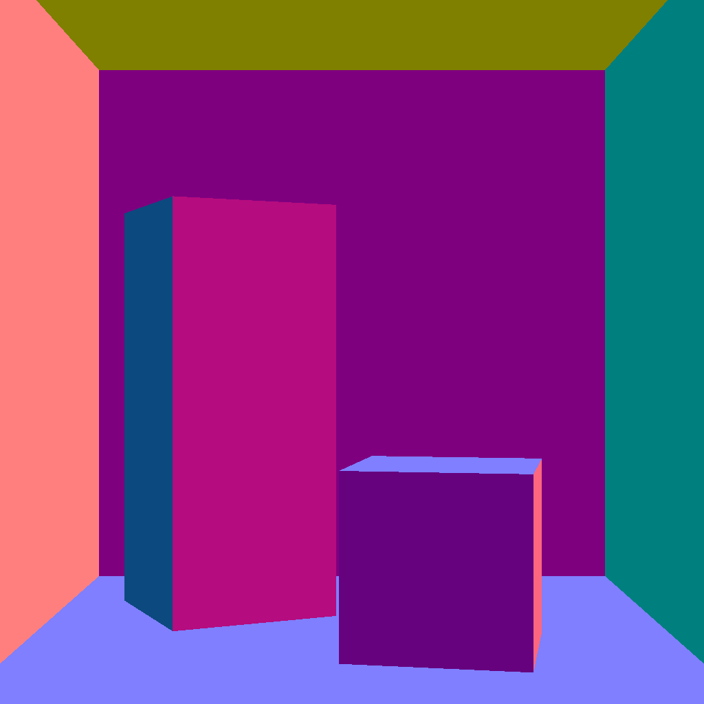
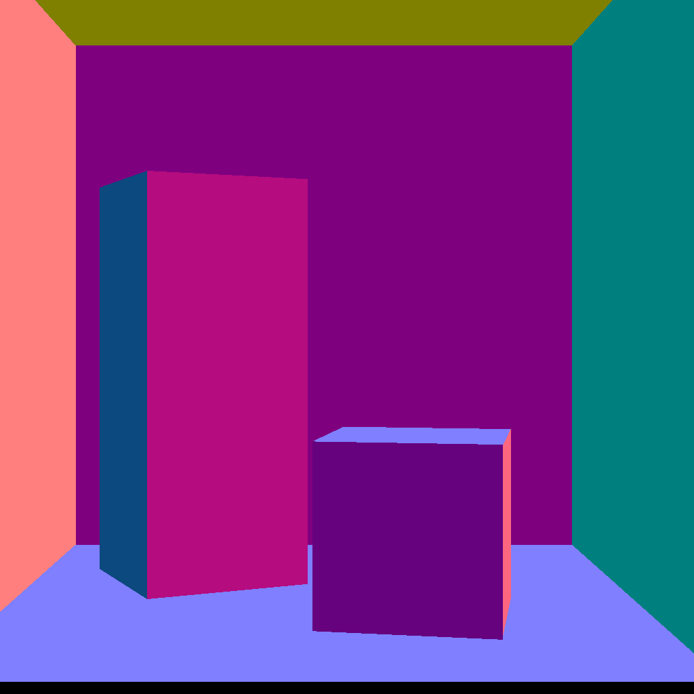

# REPORT

## Ans. 1

### Error Identification
The discrepancy is caused due to __Precision Point Error__ which arises because of the way `C++` handles the `float` data type. In the `incorrect.json` file, due to the large value of `from`, the value of `upperLeft` of the viewport also increases due to which the formula used to calculate `pixelCenter` i.e. `Vector3f pixelCenter = this->upperLeft + 0.5f * (this->pixelDeltaU + this->pixelDeltaV);` ignores the `0.5f * (this->pixelDeltaU + this->pixelDeltaV)` part leading to the discrepancy in the image.

### Solution
To correct the above error, the `from` has been translated to the origin and the images and viewport have been translated accordingly. This results in the `from` to be equal to 0. $\therefore$ the calculation error in `pixelCenter` is corrected as the value of `upperLeft` is now comparable to the rest of the equation.

### Images (after correction)
   
   
   <pre>                       Fig. Correct Image                                                 Fig. Incorrect Image</pre>

## Ans. 2
### Usage
`./ render < scene_path > < output_path > < intersection_variant >`  
Intersection Variants are as follows:
 - 0: Naı̈ve intersection
 - 1: AABB intersections
 - 2: BVH on AABB
 - 3: BVH on Triangles

 ### Rendered Images and Timings
 ### Cornell Box - Low res
   <pre>                 0. Render Time: 48092.636719 ms                                 1. Render Time: 7858.509766 ms</pre>
   
   
   <pre>             Fig. Cornel Box - Low Resolution - Variant 0                  Fig. Cornel Box - Low Resolution - Variant 1</pre>
   <pre>                 2. Render Time: 7888.810059 ms                                 3. Render Time: 1698.715942 ms</pre>
   
   
   <pre>             Fig. Cornel Box - Low Resolution - Variant 2                  Fig. Cornel Box - Low Resolution - Variant 3</pre>

 ### Cornell Box - High res
   <pre>                 0. Render Time: 193711.453125 ms                                  1. Render Time: 30503.218750 ms</pre>
   
   
   <pre>             Fig. Cornel Box - High Resolution - Variant 0                  Fig. Cornel Box - High Resolution - Variant 1</pre>
   <pre>                 2. Render Time: 30811.187500 ms                                 3. Render Time: 6104.667969 ms</pre>
   
   
   <pre>          Fig. Cornel Box - High Resolution - Variant 2                  Fig. Cornel Box - High Resolution - Variant 3</pre>
    
 ### Donuts
   <pre>                 0. Render Time: 59800.773438 ms                                 1. Render Time: 43191.800781 ms</pre>
   
   
   <pre>                   Fig. Donuts - Variant 0                                          Fig. Donuts - Variant 1</pre>
   <pre>                 2. Render Time: 41159.484375 ms                                 3. Render Time: 9056.805664 ms</pre>
   
   
   <pre>                   Fig. Donuts - Variant 2                                          Fig. Donuts - Variant 3</pre>
    
 ### Table Top
   <pre>                 0. Render Time: 57024.238281 ms                                 1. Render Time: 8483.528320 ms</pre>
   
   
   <pre>                   Fig. Table Top - Variant 0                                       Fig. Table Top - Variant 1</pre>
   <pre>                 2. Render Time: 8385.413086 ms                                 3. Render Time: 1721.107056 ms</pre>
   
   
   <pre>                   Fig. Table Top - Variant 2                                       Fig. Table Top - Variant 3</pre>