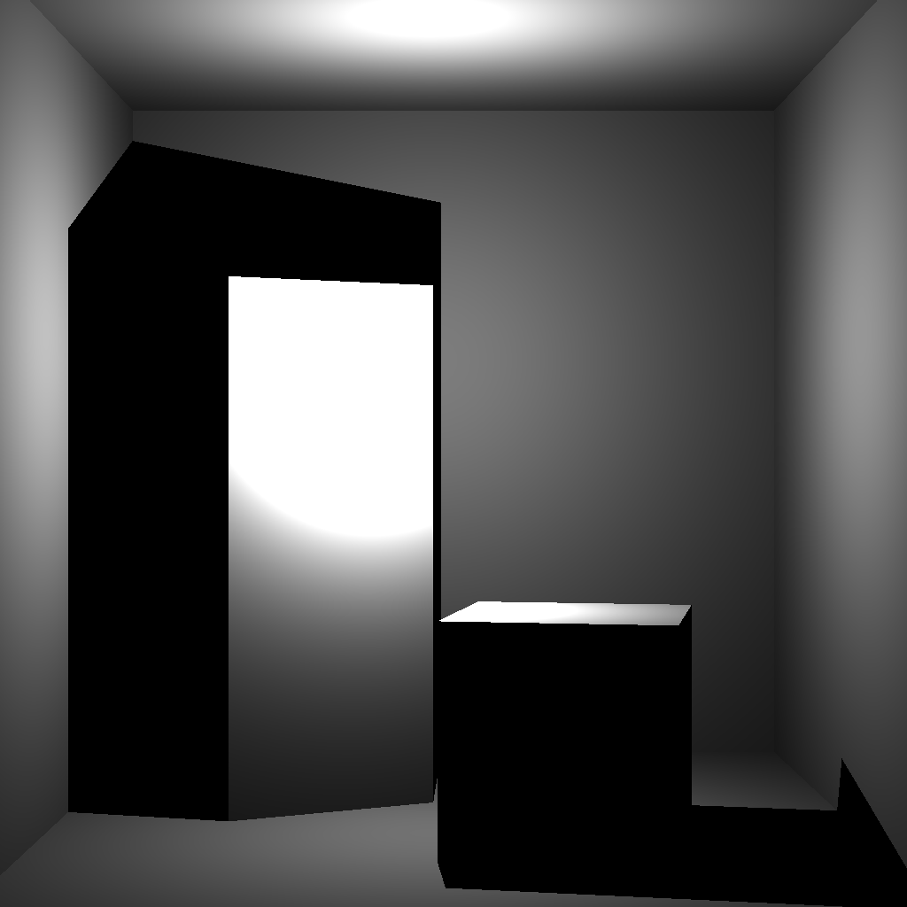
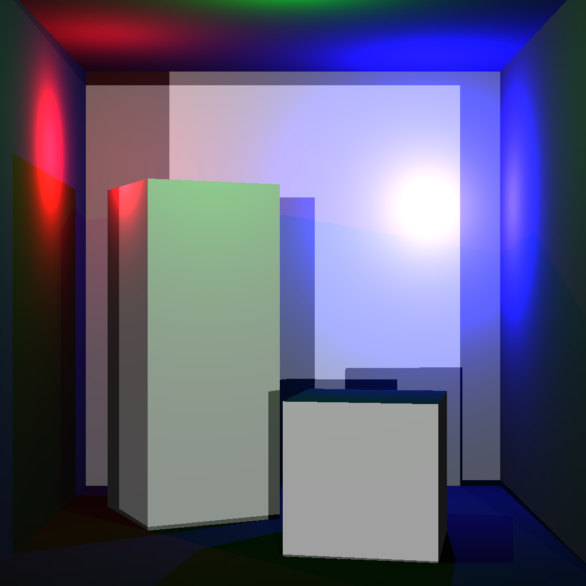
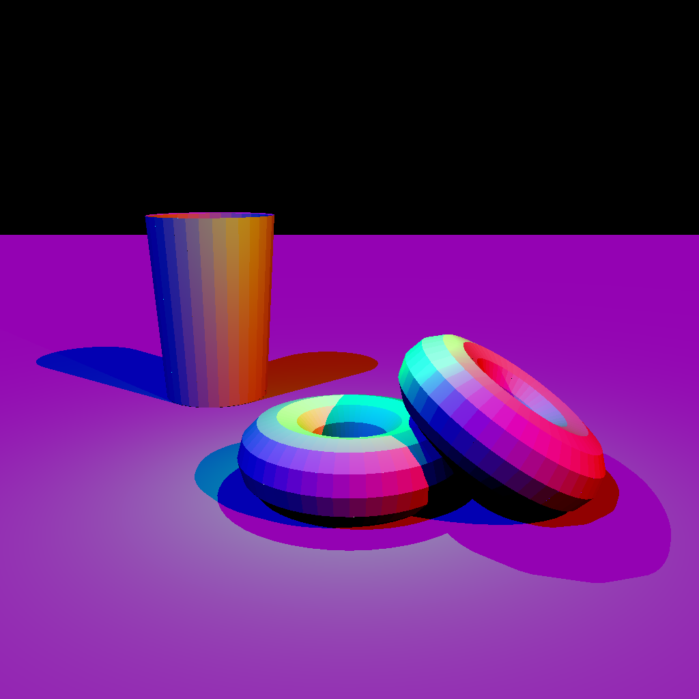
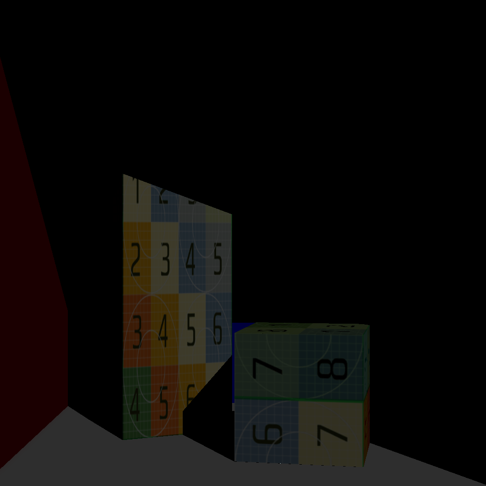
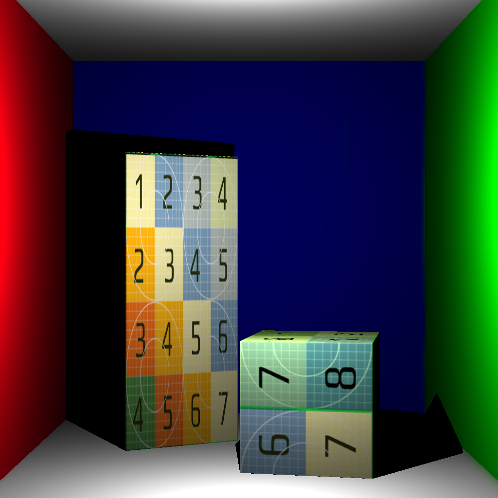
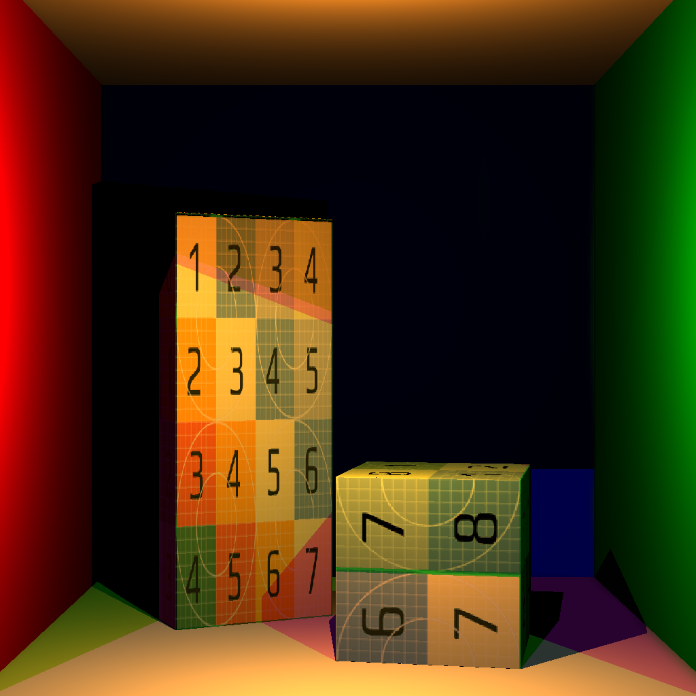
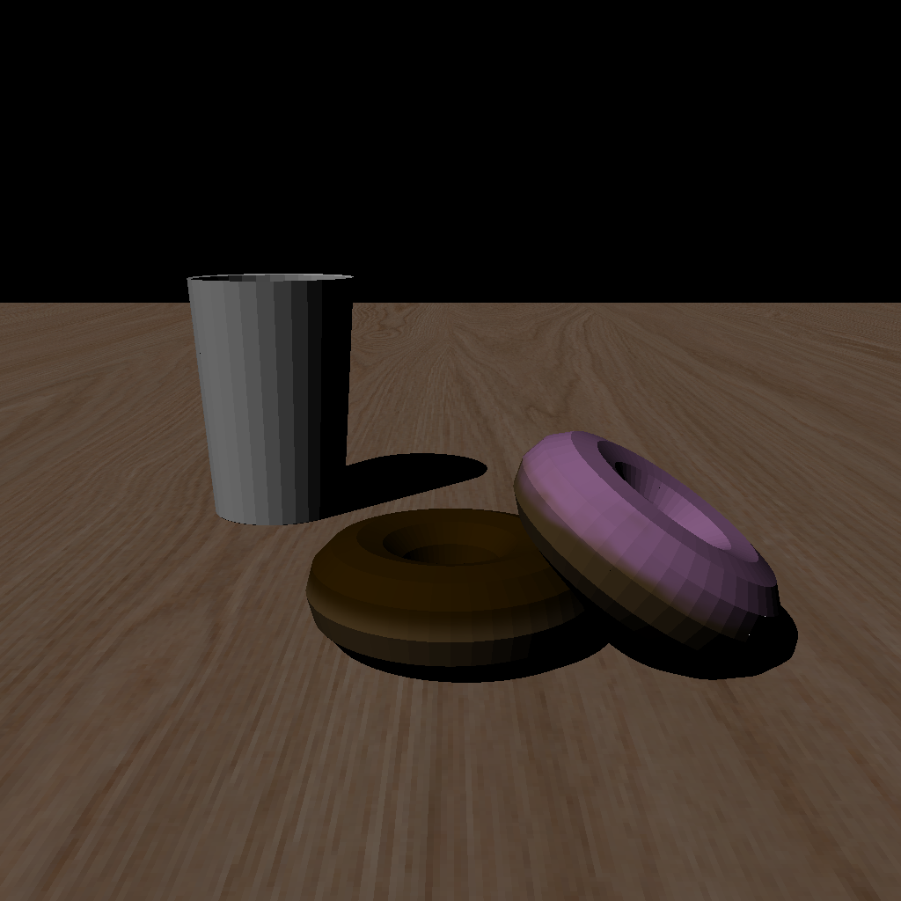
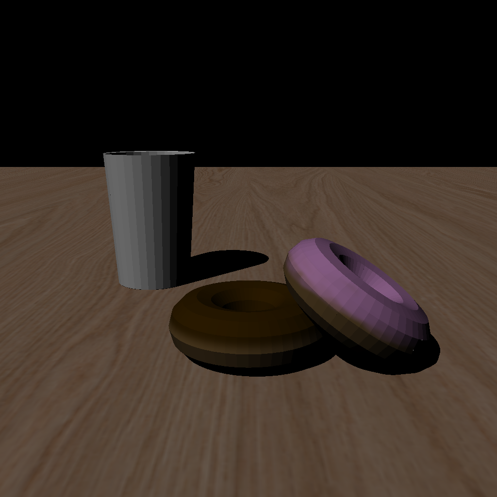
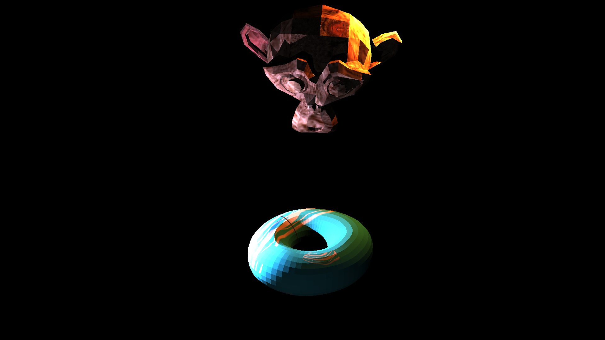

# Report

### Usage
`./ render < scene_path > < output_path > < interpolation_variant >`  
  
Interpolation Variants are as follows:
 - 0: Nearest-Neighbour Interpolation
 - 1: Bilinear Interpolation

## Question 1
### Rendered Images and Timings
### Cornell Box
<pre>                   Render Time: 459.708008 ms                                     Render Time: 529.263000 ms</pre>

<pre>                    Fig. Directional Light                                             Fig. Point Light</pre> 
<pre>                   Render Time: 1390.536987 ms</pre>

<pre>                    Fig. Many Lights</pre>  
  
### Donuts
<pre>                   Render Time: 1550.201050 ms</pre>

<pre>                    Fig. Donut</pre>  
  
## Question 2
### Rendered Images and Timings
### Cornell Box
<pre>                 0. Render Time: 464.733002 ms                                 1. Render Time: 474.934998 ms</pre>

<pre>             Fig. Nearest Neighbour - Directional Light                       Fig. Bilinear - Directional Light</pre> 
<pre>                 0. Render Time: 477.359985 ms                                 1. Render Time: 477.532013 ms</pre>

<pre>                Fig. Nearest Neighbour - Point Light                              Fig. Bilinear - Point Light</pre>
<pre>                 0. Render Time: 838.695007 ms                                 1. Render Time: 858.768005 ms</pre>

<pre>                Fig. Nearest Neighbour - Many Lights                              Fig. Bilinear - Many Lights</pre>  
  
### Donuts
<pre>                 0. Render Time: 1056.269043 ms                                1. Render Time: 1071.197998 ms</pre>

<pre>                  Fig. Nearest Neighbour - Donuts                                    Fig. Bilinear - Donuts</pre>  
  
## Question 3
### Rendered Images and Timings
### Monkey & Donut (MonDon)
<pre>                  0. Render Time: 1743.685059 ms                               1. Render Time: 1738.937988 ms</pre>

<pre>                  Fig. Nearest Neighbour - MonDon                                    Fig. Bilinear - MonDon</pre>
