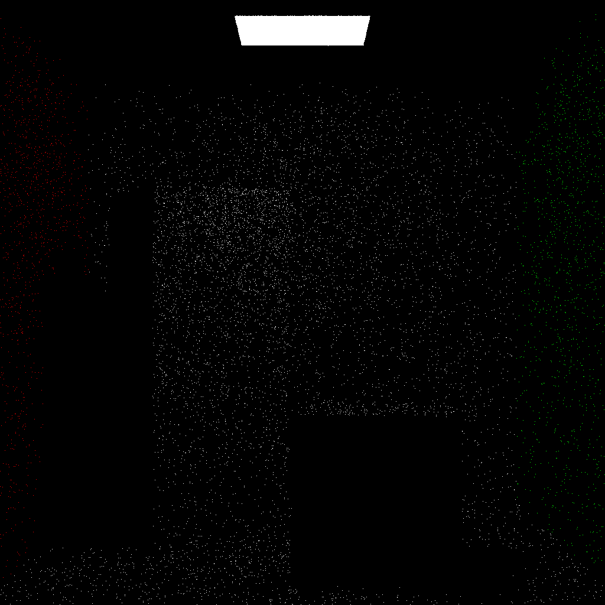
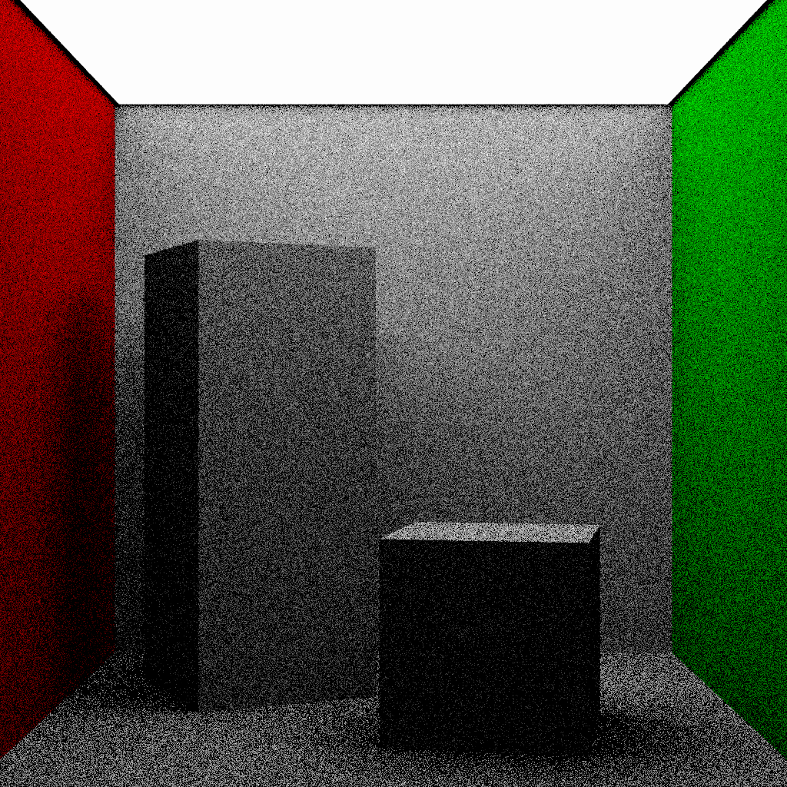

# Report - Assignment 3 (Sampling)
    
## Questions
  
__Q.1)__ Why can’t we render point and directional lights with uniform hemisphere sampling or cosine weighted sampling?  
  
__Ans.1)__ Point and directional lights are delta distributions and cannot be rendered using `Monte Carlo Estimation`. Rendering them with `Uniform Hemisphere Sampling` or `Cosine Weighted Sampling` would lead to inaccuracies and artifacts in the rendered image.  
Intutitively also, directional lights are present at infinity, $\therefore$ a sampled `omega` will never hit a directional light. On the other hand, the probability of hitting a point light is always 0, $\therefore$ `omega` can never hit a point light also.  
This is why point and directional lights are sampled using special techniques like `importance sampling`.
  
---
__Q.2)__ Why does the noise increase for the same number of samples in the case of uniform hemisphere and cosine weighted sampling as the size of the area light decreases?  
  
__Ans.2)__ When the size of the area light decreases, the number of samples taken from that light source effectively decreases as well. This reduction in the number of samples means that fewer points are contributing to the estimation of the lighting integral, leading to increased noise in the final rendered image.

---
  
## Output Images
  
### Ans.1)
<pre>                        1 spp                                            32 spp</pre>
&nbsp;

<pre>             Render Time: 1854.749023 ms                      Render Time: 68770.625000 ms</pre>  
  
### Ans.2)
<pre>                       Scene 1                                           Scene 2</pre>
&nbsp;

<pre>             Render Time: 1619.447021 ms                      Render Time: 1586.343018 ms</pre>
<pre>                       Scene 3                                           Scene 4</pre>
&nbsp;

<pre>             Render Time: 1611.917969 ms                      Render Time: 3453.168945 ms</pre>  
  
### Ans.3)
 - __UHS__: Uniform Hemisphere Sampling - Option 0  
 - __CWS__: Cosine Weighted Sampling - Option 1  
 - __LS__: Light Sampling - Option 2  
  
#### Small Light
___1 spp___  
<pre>                 UHS                                    CWS                                       LS</pre>
&nbsp;
&nbsp;

<pre>     Render Time: 1304.573975 ms             Render Time: 1289.692017 ms              Render Time: 965.729980 ms</pre>  
  
___10 spp___  
<pre>                 UHS                                    CWS                                       LS</pre>
&nbsp;
&nbsp;

<pre>     Render Time: 12610.800781 ms           Render Time: 12392.841797 ms             Render Time: 8726.453125 ms</pre>  
  
___100 spp___
<pre>                 UHS                                    CWS                                       LS</pre>
&nbsp;
&nbsp;

<pre>     Render Time: 128921.218750 ms          Render Time: 124854.734375 ms            Render Time: 92179.117188 ms</pre>  
  
___1000 spp___
<pre>                 UHS                                    CWS                                       LS</pre>
&nbsp;
&nbsp;

<pre>     Render Time: 2582612.750000 ms         Render Time: 2007794.000000 ms          Render Time: 1588980.500000 ms</pre>  
  
#### Medium Light
___1 spp___  
<pre>                 UHS                                    CWS                                       LS</pre>
&nbsp;
&nbsp;

<pre>      Render Time: 1296.452026 ms              Render Time: 1259.848999 ms              Render Time: 942.450012 ms</pre>  
  
___10 spp___  
<pre>                 UHS                                    CWS                                      LS</pre>
&nbsp;
&nbsp;

<pre>     Render Time: 12470.289062 ms            Render Time: 12468.554688 ms            Render Time: 9033.758789 ms</pre>  
  
___100 spp___
<pre>                 UHS                                    CWS                                      LS</pre>
&nbsp;
&nbsp;

<pre>     Render Time: 124299.968750 ms           Render Time: 121258.125000 ms            Render Time: 89924.218750 ms</pre>  
  
___1000 spp___
<pre>                 UHS                                    CWS                                      LS</pre>
&nbsp;
&nbsp;

<pre>   Render Time: 2544081.000000 ms           Render Time: 1984135.375000 ms            Render Time: 1558483.250000 ms</pre>  
  
#### Big Light
___1 spp___  
<pre>                 UHS                                    CWS                                      LS</pre>
&nbsp;
&nbsp;

<pre>    Render Time: 1291.939941 ms              Render Time: 1249.047974 ms              Render Time: 949.583984 ms</pre>  
  
___10 spp___  
<pre>                 UHS                                    CWS                                      LS</pre>
&nbsp;
&nbsp;

<pre>    Render Time: 12445.934570 ms             Render Time: 12285.753906 ms            Render Time: 9260.351562 ms</pre>  
  
___100 spp___
<pre>                 UHS                                    CWS                                      LS</pre>
&nbsp;
&nbsp;

<pre>    Render Time: 123128.140625 ms           Render Time: 119270.289062 ms            Render Time: 89972.546875 ms</pre>  
  
___1000 spp___
<pre>                 UHS                                    CWS                                      LS</pre>
&nbsp;
&nbsp;

<pre>    Render Time: 2484186.250000 ms         Render Time: 1961855.250000 ms           Render Time: 1618413.750000 ms</pre>  
  
#### Many Lights
___1 spp___  
<pre>                 UHS                                    CWS                                      LS</pre>
&nbsp;
&nbsp;

<pre>    Render Time: 2990.212891 ms               Render Time: 2907.393066 ms            Render Time: 2021.406006 ms</pre>  
  
___10 spp___  
<pre>                 UHS                                    CWS                                      LS</pre>
&nbsp;
&nbsp;

<pre>   Render Time: 51661.894531 ms              Render Time: 50340.664062 ms            Render Time: 31882.576172 ms</pre>  
  
___100 spp___
<pre>                 UHS                                    CWS                                      LS</pre>
&nbsp;
&nbsp;

<pre>   Render Time: 514016.250000 ms            Render Time: 294716.406250 ms            Render Time: 193115.796875 ms</pre>  
  
___1000 spp___
<pre>                 UHS                                    CWS                                      LS</pre>
&nbsp;
&nbsp;

<pre>   Render Time: 7322028.000000 ms           Render Time: 7244697.500000 ms          Render Time: 5748835.000000 ms</pre>